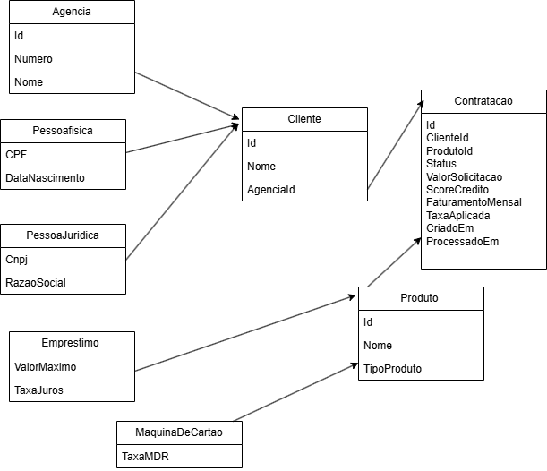
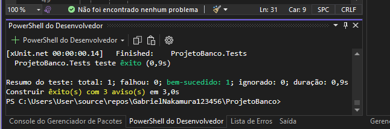
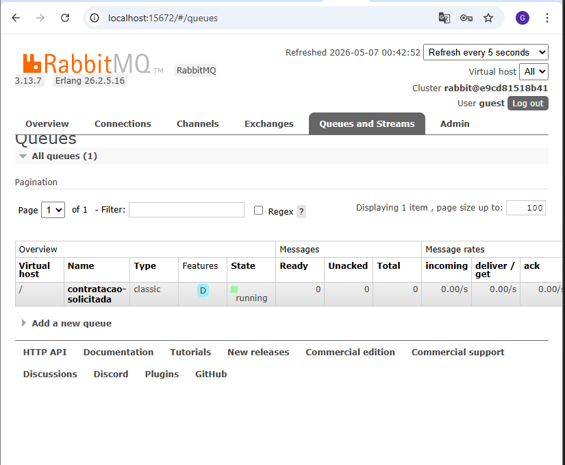
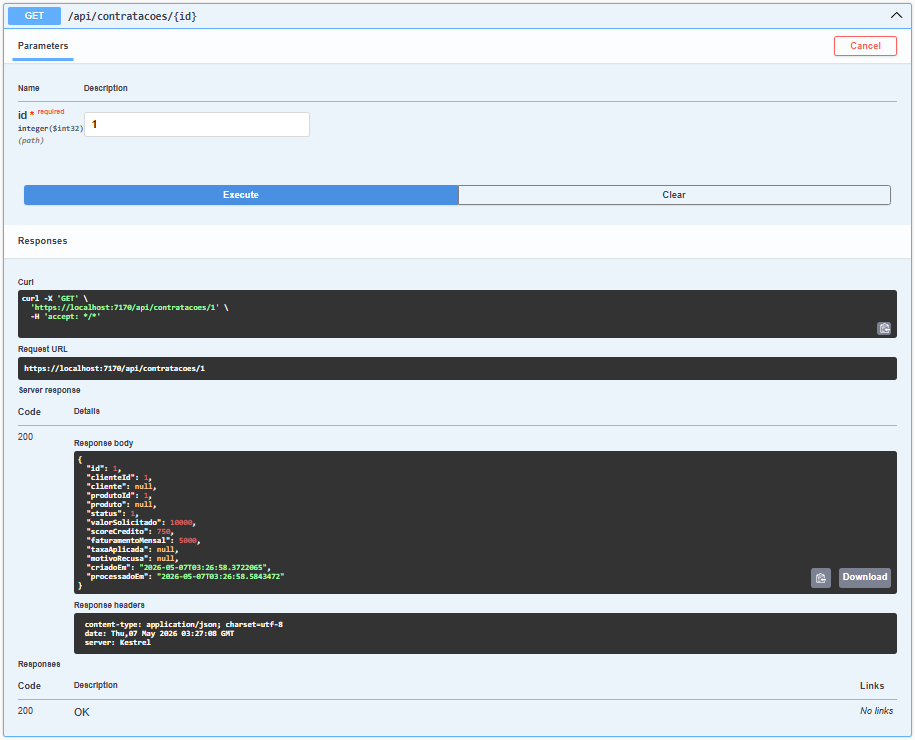
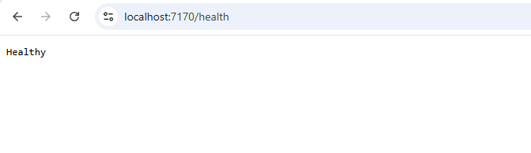
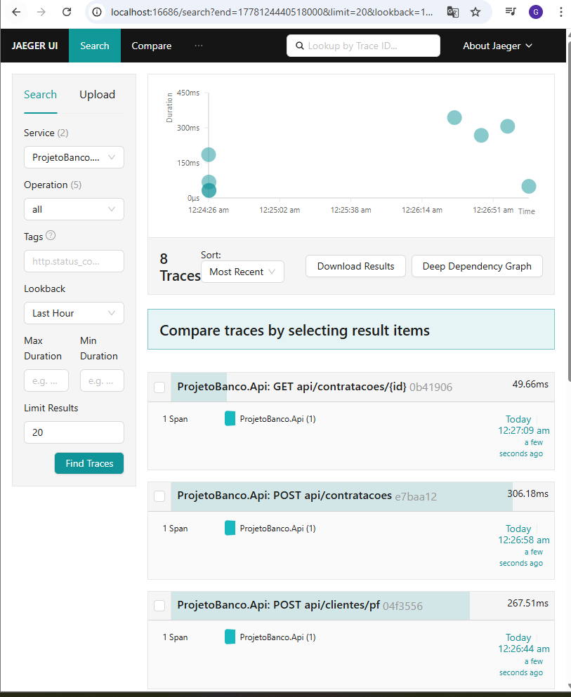

# ProjetoBanco API

## 1. Integrantes

- Gabriel Nakamura Ogata — RM560671
- Guilherme Costeira Braganholo — RM560628
- Julio Cesar Dias Vilella — RM560494

---

## 2. Produto bancário escolhido e justificativa

Os produtos bancários escolhidos foram:

- Empréstimo Pessoal
- Máquina de Cartão

A escolha foi feita porque esses produtos permitem simular regras reais de análise bancária, como validação de score de crédito, análise de faturamento e aprovação ou recusa automática da contratação.

---

## 3. Decisão de modelagem de filas

Foi utilizada uma única fila RabbitMQ:

```text
contratacao-solicitada

A escolha por uma única fila foi feita para centralizar o processamento das contratações e simplificar o fluxo de mensageria.

Fluxo:

A API recebe a solicitação de contratação.
A contratação é salva com status pendente.
O Producer publica a mensagem no RabbitMQ.
O Consumer processa a mensagem em BackgroundService.
A contratação é aprovada ou recusada.
O Consumer realiza ACK manual da mensagem.
4. Diagrama de Classes

Adicionar o diagrama em:

docs/diagrama-classes.png

Referência no README:


5. Como rodar localmente
Pré-requisitos
.NET 8 SDK
Visual Studio 2022
Docker Desktop
Oracle FIAP
Clonar o projeto
git clone https://github.com/GabrielNakamura123456/ProjetoBanco.git
Subir RabbitMQ e Jaeger
docker compose up -d

RabbitMQ:

http://localhost:15672

Usuário:

guest

Senha:

guest

Jaeger:

http://localhost:16686
Executar migrations Oracle
dotnet ef database update --project ProjetoBanco.Api
Rodar a API
dotnet run --project ProjetoBanco.Api

Swagger:

https://localhost:7170/swagger

Health:

https://localhost:7170/health
6. Endpoints disponíveis
Criar agência
POST /api/agencias

Request:

{
  "numero": "0001",
  "nome": "Agencia Central"
}
Buscar agência
GET /api/agencias/{id}
Criar pessoa física
POST /api/clientes/pf

Request:

{
  "nome": "Gabriel Nakamura",
  "cpf": "99988877766",
  "dataNascimento": "2004-01-01T00:00:00",
  "agenciaId": 1
}
Criar pessoa jurídica
POST /api/clientes/pj

Request:

{
  "nome": "Empresa XPTO",
  "cnpj": "12345678000199",
  "razaoSocial": "Empresa XPTO LTDA",
  "agenciaId": 1
}
Buscar cliente
GET /api/clientes/{id}
Solicitar contratação
POST /api/contratacoes

Request:

{
  "clienteId": 1,
  "produtoId": 1,
  "valorSolicitado": 10000,
  "scoreCredito": 750,
  "faturamentoMensal": 5000
}

Response esperado:

{
  "id": 1,
  "status": 0,
  "valorSolicitado": 10000
}
Consultar contratação
GET /api/contratacoes/{id}

Response após processamento:

{
  "id": 1,
  "status": 1,
  "valorSolicitado": 10000,
  "processadoEm": "2026-05-07T..."
}
Health Check
GET /health

Resposta:

Healthy
7. Como executar os testes

Executar:

dotnet test

Adicionar print do resultado dos testes:


8. Print do painel RabbitMQ

Print do RabbitMQ mostrando a fila contratacao-solicitada:


9. Print da API rodando no Swagger

Print do Swagger mostrando uma contratação aprovada:


Prints adicionais
Health Check

Jaeger

Observabilidade

O projeto utiliza:

Serilog
OpenTelemetry
Jaeger

O Jaeger recebe traces das chamadas HTTP realizadas na API, permitindo visualizar operações como:

POST /api/agencias
POST /api/clientes/pf
POST /api/contratacoes
GET /api/contratacoes/{id}
Tecnologias utilizadas
ASP.NET Core 8
Entity Framework Core
Oracle Database
RabbitMQ
Docker
Swagger
Serilog
OpenTelemetry
Jaeger
xUnit